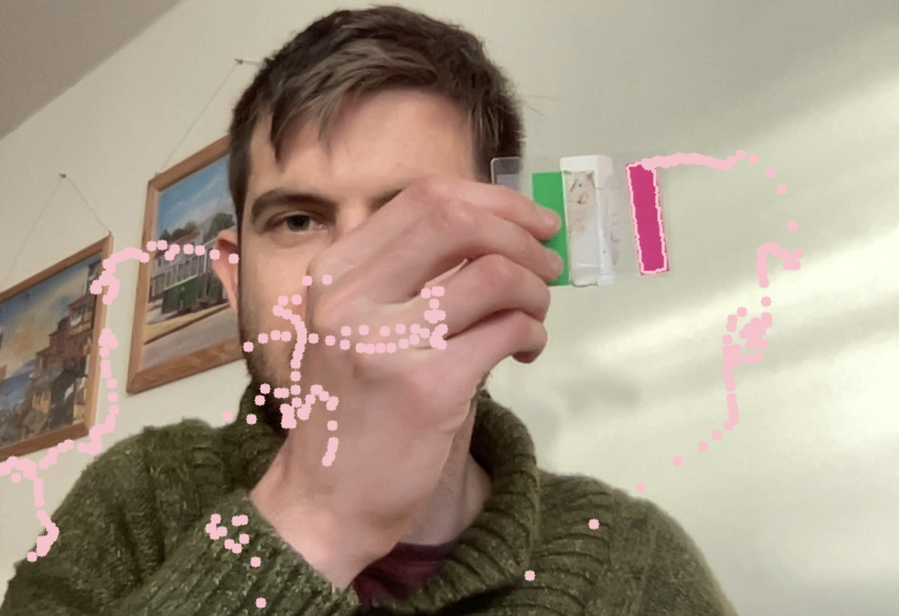

# learning-opencv

Repository to try out OpenCV and wxPython to create an App for Labelling.

I followed [this](https://www.youtube.com/watch?v=WQeoO7MI0Bs&t=7918s) Youtube tutorial for the basics of OpenCV and [this](https://www.youtube.com/watch?v=dikn50cu5lo&list=PLYpyJJEou2GF8LGuRH_pB342R5NzwiMu3) playlist of Youtube videos for the basics of wxPython.

This is what I learned in the scripts:

### OpenCV
- [test.py](https://github.com/richardvogg/learning-opencv/blob/main/scripts/test.py)
    - Display an image
    - Crop, resize an image
    - Apply filters to an image
    - Display a video
- [shapes.py](https://github.com/richardvogg/learning-opencv/blob/main/scripts/shapes.py)
    - Create lines, polygons, circles and text with OpenCV
    - Stack several images horizontally or vertically.
- [colorConversion.py](https://github.com/richardvogg/learning-opencv/blob/main/scripts/colorConversion.py)
    - Use trackbars to filter out certain colors of an image
- [drawOnScreen.py](https://github.com/richardvogg/learning-opencv/blob/main/scripts/drawOnScreen.py)
    - "Draw" with a selected color on the screen which is recording from the webcam. "Draw" is in quotes, because the program is simply detecting the color (e.g. in a pencil) and drawing dots where it moves.

- [show_bboxes.py](https://github.com/richardvogg/learning-opencv/blob/main/scripts/show_bboxes.py)
    - Load a video of monkeys and the .txt file with the output of the monkey tracking model.
    - Draw bounding boxes from the .txt file into the video.
    - Allow user to move between frames by pressing the "D" key.
- [click_bounding_box.py](https://github.com/richardvogg/learning-opencv/blob/main/scripts/click_bounding_box.py)
    - Opens an image.
    - Allows user to draw bounding boxes on the image by selecting a top left and bottom right point.
    - Displays bounding boxes.

### wxPython

(to run the scripts I have to write ```pythonw scripts/FirstApp.py``` (the w is important on the Mac))

- [FirstApp.py](https://github.com/richardvogg/learning-opencv/blob/main/scripts/FirstApp.py)
    - Simple app having a text input asking for your name and a button. When you click the button, your name is printed, and a dialog is opened.
    - On the dialog there is a checkbox "Never show this message again", after which you can continue to get your name printed without showing the dialog.
- [SecondApp.py](https://github.com/richardvogg/learning-opencv/blob/main/scripts/SecondApp.py)
    - App with a menu bar, which allows you to open a .txt file and to save a .txt file.
    - The main frame contains several widgets (text box, choices, checkboxes).
    - Everything is arranged through sizers (vertical and horizontal).
- [WebBrowserApp.py](https://github.com/richardvogg/learning-opencv/blob/main/scripts/WebBrowserApp.py)
    - Simulating a webbrowser with a forward and a backbutton as well as a text box.
    - It is not super cool, but I think you can actually have it work as a real webbrowser (I just did not understand how).
- [MonkeyApp.py](https://github.com/richardvogg/learning-opencv/blob/main/scripts/MonkeyApp.py)
    - Displaying a video and bounding boxes of detected monkeys.
    - User can move between frames.
    - User can correct labels (for example if a monkey is not correctly re-identified after a jump) which are immediately updated in the video.